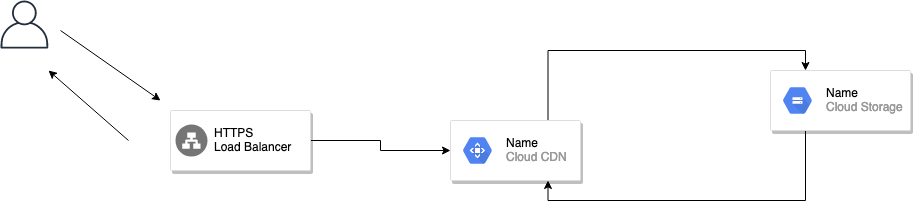
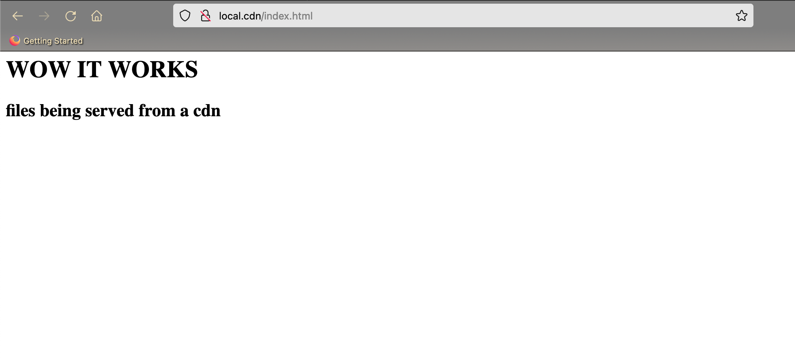

## What's this?
A terraform project that creates a Google cloud CDN backed by a google cloud storage bucket. Built this over the course of two days to scratch an itch i had to see how hard this could be with terraform


## Architecture Diagram 
:) forgive me as this would provison a http loadbalancer not https. See [here](https://registry.terraform.io/providers/hashicorp/google/latest/docs/resources/compute_target_https_proxy) for how to provison a https loadbalancer



## Setup 

### Use the current project
`export PROJECT=$(gcloud config get-value project)`

### Create a service account
```bash
gcloud iam service-accounts create cloudcdn-serviceaccount \
  --description "evil corp cdn service account" \
  --display-name "cloudcdn-serviceaccount"
```

### Assign the owner role to the service account
```bash
gcloud projects add-iam-policy-binding ${PROJECT} \
  --member serviceAccount:cloudcdn-serviceaccount@${PROJECT}.iam.gserviceaccount.com \
  --role roles/owner
```

### Create service account keys
```bash
gcloud iam service-accounts keys create \
  ./service-account.json \
  --iam-account cloudcdn-serviceaccount@${PROJECT}.iam.gserviceaccount.com
```

## Enable the compute engine API
```bash
gcloud services enable compute.googleapis.com
```

### Plan  :memo:
```bash
terraform plan
```

### Apply :rotating_light:
```bash
terraform apply
```

### Test things out!! :mag:
copy the test html page to the storage bucket you just created

```bash 
gsutil cp index.html <bucket name>
```

next grab your loadbalancers external ip from https://console.cloud.google.com/net-services/loadbalancing/loadBalancers/list

and head to http://external_ip/index.html




